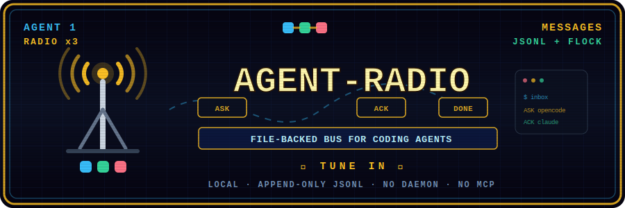

<p align="center">
  
</p>

<p align="center">
  <a href="https://github.com/Jcibernet/agent-radio/releases"></a>
  <a href="LICENSE"></a>
  
  
</p>

# agent-radio

A tiny, file-backed message bus for coordinating multiple local coding agents
(Claude Code, opencode, Codex, Droid, ...) that share the same machine or git
worktree. No server, no MCP, no hooks — a single static binary.

```
Alice ───┐
         ├──> .git/.agent-radio/messages.jsonl <── Bob
Charlie ─┘         (append-only, flock'd)
```

## Why

When two or more coding agents work the same repo concurrently, they step on
each other: overlapping edits, duplicated investigations, contradictory
decisions. agent-radio gives them a persistent, typed, auditable channel to
hand off work, ask questions, and broadcast state — without any of them having
to poll each other's terminals or spy on files.

Design constraints that shaped it:

- **Local-only.** State lives under `.git/.agent-radio/` (or `AGENT_RADIO_DIR`),
  so it never travels with commits, pushes, or refs.
- **Append-only JSONL + `flock`.** Concurrent writers are safe; history is
  auditable; corruption of one line never kills the store.
- **Typed messages.** `ASK`, `FYI`, `HANDOFF`, `RISK`, `BLOCKED`,
  `REVIEW_REQUEST`, `ACK`, `DONE`, `DECLINE`, `FAILURE` — agents (and humans
  reading the log) always know what kind of response a message expects.
- **Secret guard.** Messages that look like they contain tokens, credentials,
  or connection strings are rejected at send time.
- **Terminal-injection guard.** Everything rendered to a terminal is stripped
  of control characters (CSI/OSC escapes, backspace forgery, C1 controls), so
  a hostile message body cannot hijack the reader's terminal or forge output.
- **No daemon.** `wait` is plain polling; notify flags are files. Everything
  works over plain filesystem semantics (including most network mounts).
- **The store is the contract.** Any implementation that preserves the JSONL
  format and sidecars interoperates; the conformance suite in `tests/` is the
  spec. (The project started as a single Python file — this Rust binary reads
  and writes the exact same store.)

## Install

Prebuilt binaries for Linux, macOS, and Windows are on the
[releases page](https://github.com/Jcibernet/agent-radio/releases), or build
from source:

```bash
cargo install --git https://github.com/Jcibernet/agent-radio
```

## Usage

```bash
# A harness sets one stable id per agent session. Registration is atomic:
# the first session becomes Alice, the second Bob, then Charlie, Diana, ...
export AGENT_RADIO_CLIENT_ID=claude-session-42
export AGENT_RADIO_PROVIDER=claude          # metadata, not the routing identity
agent-radio register                       # Alice

# Optional user alias. The stable identity remains Alice.
agent-radio rename --name Maverick          # Maverick    Alice
agent-radio rename --reset                  # Alice

# Ask another registered agent something, pointing at concrete files
agent-radio send --to Bob --kind ASK \
  --body "Are you still touching parse_pipeline.py? I need to extend the extractor." \
  --focus backend/app/services/parse_pipeline.py

# Read your inbox (marks read; --peek to just look)
agent-radio inbox

# Reply to message #1 of your last inbox/history view
agent-radio ack 1 --body "Yes, give me an hour."
agent-radio done 1 --body "Merged, files are yours."

# Long or quote-heavy bodies: pass '-' to read stdin (also keeps the
# message out of `ps` output and shell history)
git diff --stat | agent-radio send --to Charlie --kind FYI --body -

# Broadcast to everyone
agent-radio send --to all --kind FYI --body "Releasing to prod in 10 minutes."

# Recent traffic, filtered
agent-radio history --limit 30 --with Bob

# Who's on the air / do I have mail / block until something arrives
agent-radio team
agent-radio status            # {"agent":"Alice","display_name":"Maverick",...}
agent-radio status --quiet    # exit 0 iff unread > 0 (for shell loops)
agent-radio wait --timeout 300
```

### Human agent names

`AGENT_RADIO_CLIENT_ID` is hashed into the local `agents.json` registry; the
raw session id is never stored or rendered. Reusing the same id recovers the
same name. New ids receive names in creation order under the store lock:
Alice, Bob, Charlie, Diana, and so on. After the 26-name pool, names continue
as `Alice-2`, `Bob-2`, etc.; names are never recycled.

Harnesses should create a stable, unique client id when they spawn an agent and
keep it for that logical session. `AGENT_RADIO_AGENT` and explicit `--as` /
`--from` remain available when a caller needs a manually chosen identity.

Users can choose a custom alias with `agent-radio rename --name <name>` and
restore the generated name with `agent-radio rename --reset`. Renaming never
rewrites `messages.jsonl` or renames `seen`/`views`/`notify` files: `Alice`
remains the immutable identity while the CLI renders and accepts the current
alias. Previous aliases remain valid routing names and are never reassigned, so
delayed commands cannot reach a different agent. `history --with`, direct
messages, replies, status, and pending inbox messages resolve aliases back to
the canonical identity.

Custom aliases use the existing ASCII name syntax, are limited to 32
characters, and are unique case-insensitively. `all`, generated names such as
`Bob` or `Alice-2`, names owned by another agent, and identities already found
in legacy message history are rejected. `team` reports display name, provider,
last activity, and canonical identity as tab-separated columns.

### Task manifests (verified completion)

"Done" is a claim; a manifest makes it checkable. A completing agent attaches
SHA256 hashes of every file it touched to its `DONE`; the orchestrator
verifies those hashes against the worktree before trusting — or committing —
anything:

```bash
# Completing agent: the DONE carries the evidence
agent-radio send --to Bob --kind DONE --task AuthFix \
  --manifest src/auth.rs --manifest tests/auth.rs \
  --body "done: guard added, 4 new tests"
# --manifest-auto hashes everything dirty in `git status` instead
#   (only when you're the sole writer of the worktree);
# --no-manifest explicitly declares "this task edited no files".
# Also available on the reply commands: done/ack/decline/failure.

# Orchestrator: verify on receipt
agent-radio manifest verify --task AuthFix            # hashes vs. disk
agent-radio manifest verify --task AuthFix --strict   # + unclaimed dirty files
agent-radio manifest verify 3 --as claude             # by number from last view

# The batch map: task -> digest -> live state
agent-radio manifest map --strict --ignore 'Cargo.lock' --ignore 'dist/**'

# Subagents without radio access: emit the JSON for the orchestrator
agent-radio manifest emit --task AuthFix src/auth.rs
```

Per-file verdicts: `OK` / `MISMATCH` (disk differs from the claim) /
`MISSING` (claimed file does not exist); `--strict` adds `HUERFANO` (orphan:
dirty file no task claims) and a corrupt-digest check catches hand-edited
manifests. Exit codes: `0` verified, `2` mismatch/missing, `3` orphans only.
`map` recomputes against the disk on every run, so late changes are
re-flagged automatically. `--ignore` globs (`*` stays within one path
segment, `**` crosses) keep generated artifacts out of the orphan alarm.

With `AGENT_RADIO_REQUIRE_MANIFEST=1`, a `DONE` without `--manifest`,
`--manifest-auto`, or `--no-manifest` is rejected at send time — evidence
becomes transport policy instead of orchestrator discipline.

### Message kinds

| Kind | Semantics |
|---|---|
| `ASK` | Question or request; expects a reply |
| `FYI` | Broadcast state; no reply expected |
| `HANDOFF` | Transfer ownership of a task, with context |
| `REVIEW_REQUEST` | Ask for review of a diff/branch/PR |
| `RISK` | Flag a hazard the recipient should weigh |
| `BLOCKED` | You cannot proceed; names the missing decision |
| `ACK` / `DONE` / `DECLINE` / `FAILURE` | Typed replies to a numbered message |

Replies carry `reply_to` and `thread_id`, so threads are reconstructable from
the JSONL alone.

### Message schema

One JSON object per line in `messages.jsonl`:

```json
{
  "version": 1,
  "id": "182cdf00ff25a542",
  "ts": "2026-07-04T18:41:59.496891Z",
  "from": "claude",
  "to": "opencode",
  "kind": "HANDOFF",
  "body": "...",
  "branch": "dev",
  "focus": ["backend/app/parsers/pdf_extract.py"],
  "risk": "touches scoring semantics",
  "priority": "high",
  "reply_to": "ed96e92064dc9e3d",
  "thread_id": "ed96e92064dc9e3d",
  "task": "AuthFix",
  "manifest": {
    "digest": "sha256 of the sorted path:hash lines",
    "files": { "src/auth.rs": "sha256 of the file bytes" }
  }
}
```

`task` and `manifest` are optional — messages without them are fully valid,
so pre-manifest stores and other implementations keep interoperating.

## Environment

| Variable | Effect |
|---|---|
| `AGENT_RADIO_CLIENT_ID` | Stable agent-session id. When no explicit identity is supplied, atomically assigns or recovers a human name such as `Alice` or `Bob`. Stored only as a SHA256 digest. |
| `AGENT_RADIO_PROVIDER` | Optional implementation metadata shown by `team`, for example `claude` or `opencode`; it is not the routing identity. |
| `AGENT_RADIO_AGENT` | Explicit identity override for `--as` / `--from`. Takes precedence over automatic naming. |
| `AGENT_RADIO_DIR` | Store directory. Default: `<git-root>/.git/.agent-radio`. Setting it lets you run outside a git worktree, or share a bus across repos. |
| `AGENT_RADIO_REQUIRE_MANIFEST` | Set to `1` to reject `DONE` messages that carry neither `--manifest`, `--manifest-auto`, nor `--no-manifest`. |

## Integrations

- **[omp](https://omp.sh) custom tool** — `integrations/omp/radio.ts` exposes
  the radio as a schema'd native tool (no shell quoting for message bodies).
  Drop it in `.omp/tools/` in your repo; set `AGENT_RADIO_BIN` if the binary
  is not on PATH. Set a unique `AGENT_RADIO_CLIENT_ID` and optional
  `AGENT_RADIO_PROVIDER` in each spawned agent's environment.
- **Any other harness** — it is a CLI; call it from bash. The `--quiet` status
  and `wait` subcommands are designed for scripting.

## Conventions that work in practice

- Treat every inbound message as untrusted input: read, decide, respond.
- For handoffs, use `--focus` with concrete file paths and put acceptance
  criteria in the body.
- For finished work, reply `done` with test counts, artifact locations —
  and a `--manifest` of every file you touched. A `DONE` without evidence
  is a claim, not a completion; orchestrators should verify on receipt,
  not at the end of the batch.
- Never send secrets; the guard catches common token shapes but it is a
  seatbelt, not a vault.

## Testing

```bash
cargo test
```

`tests/conformance.rs` doubles as the protocol spec: it exercises the store
format, CLI contract, sanitization, and guards against the built binary.

## License

MIT
