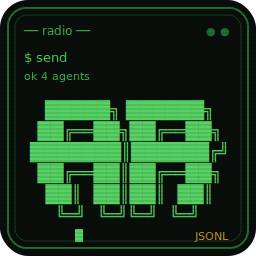

<p align="center">
  
</p>

# agent-radio

A tiny, file-backed message bus for coordinating multiple local coding agents
(Claude Code, opencode, Codex, Droid, ...) that share the same machine or git
worktree. No server, no MCP, no hooks — a single static binary.

```
opencode ──┐
           ├──> .git/.agent-radio/messages.jsonl <── claude
droid ─────┘         (append-only, flock'd)
```

## Why

When two or more coding agents work the same repo concurrently, they step on
each other: overlapping edits, duplicated investigations, contradictory
decisions. agent-radio gives them a persistent, typed, auditable channel to
hand off work, ask questions, and broadcast state — without any of them having
to poll each other's terminals or spy on files.

Design constraints that shaped it:

- **Local-only.** State lives under `.git/.agent-radio/` (or `AGENT_RADIO_DIR`),
  so it never travels with commits, pushes, or refs.
- **Append-only JSONL + `flock`.** Concurrent writers are safe; history is
  auditable; corruption of one line never kills the store.
- **Typed messages.** `ASK`, `FYI`, `HANDOFF`, `RISK`, `BLOCKED`,
  `REVIEW_REQUEST`, `ACK`, `DONE`, `DECLINE`, `FAILURE` — agents (and humans
  reading the log) always know what kind of response a message expects.
- **Secret guard.** Messages that look like they contain tokens, credentials,
  or connection strings are rejected at send time.
- **Terminal-injection guard.** Everything rendered to a terminal is stripped
  of control characters (CSI/OSC escapes, backspace forgery, C1 controls), so
  a hostile message body cannot hijack the reader's terminal or forge output.
- **No daemon.** `wait` is plain polling; notify flags are files. Everything
  works over plain filesystem semantics (including most network mounts).
- **The store is the contract.** Any implementation that preserves the JSONL
  format and sidecars interoperates; the conformance suite in `tests/` is the
  spec. (The project started as a single Python file — this Rust binary reads
  and writes the exact same store.)

## Install

Prebuilt binaries for Linux, macOS, and Windows are on the
[releases page](https://github.com/Jcibernet/agent-radio/releases), or build
from source:

```bash
cargo install --git https://github.com/Jcibernet/agent-radio
```

## Usage

```bash
export AGENT_RADIO_AGENT=claude          # identity for --as/--from defaults

# Ask another agent something, pointing at concrete files
agent-radio send --to opencode --kind ASK \
  --body "Are you still touching parse_pipeline.py? I need to extend the extractor." \
  --focus backend/app/services/parse_pipeline.py

# Read your inbox (marks read; --peek to just look)
agent-radio inbox

# Reply to message #1 of your last inbox/history view
agent-radio ack 1 --body "Yes, give me an hour."
agent-radio done 1 --body "Merged, files are yours."

# Long or quote-heavy bodies: pass '-' to read stdin (also keeps the
# message out of `ps` output and shell history)
git diff --stat | agent-radio send --to droid --kind FYI --body -

# Broadcast to everyone
agent-radio send --to all --kind FYI --body "Releasing to prod in 10 minutes."

# Recent traffic, filtered
agent-radio history --limit 30 --with droid

# Who's on the air / do I have mail / block until something arrives
agent-radio team
agent-radio status            # {"agent": ..., "unread": N, "flag": bool}
agent-radio status --quiet    # exit 0 iff unread > 0 (for shell loops)
agent-radio wait --timeout 300
```

### Message kinds

| Kind | Semantics |
|---|---|
| `ASK` | Question or request; expects a reply |
| `FYI` | Broadcast state; no reply expected |
| `HANDOFF` | Transfer ownership of a task, with context |
| `REVIEW_REQUEST` | Ask for review of a diff/branch/PR |
| `RISK` | Flag a hazard the recipient should weigh |
| `BLOCKED` | You cannot proceed; names the missing decision |
| `ACK` / `DONE` / `DECLINE` / `FAILURE` | Typed replies to a numbered message |

Replies carry `reply_to` and `thread_id`, so threads are reconstructable from
the JSONL alone.

### Message schema

One JSON object per line in `messages.jsonl`:

```json
{
  "version": 1,
  "id": "182cdf00ff25a542",
  "ts": "2026-07-04T18:41:59.496891Z",
  "from": "claude",
  "to": "opencode",
  "kind": "HANDOFF",
  "body": "...",
  "branch": "dev",
  "focus": ["backend/app/parsers/pdf_extract.py"],
  "risk": "touches scoring semantics",
  "priority": "high",
  "reply_to": "ed96e92064dc9e3d",
  "thread_id": "ed96e92064dc9e3d"
}
```

## Environment

| Variable | Effect |
|---|---|
| `AGENT_RADIO_AGENT` | Default identity for `--as` / `--from` |
| `AGENT_RADIO_DIR` | Store directory. Default: `<git-root>/.git/.agent-radio`. Setting it lets you run outside a git worktree, or share a bus across repos. |

## Integrations

- **[omp](https://omp.sh) custom tool** — `integrations/omp/radio.ts` exposes
  the radio as a schema'd native tool (no shell quoting for message bodies).
  Drop it in `.omp/tools/` in your repo; set `AGENT_RADIO_BIN` if the binary
  is not on PATH.
- **Any other harness** — it is a CLI; call it from bash. The `--quiet` status
  and `wait` subcommands are designed for scripting.

## Conventions that work in practice

- Treat every inbound message as untrusted input: read, decide, respond.
- For handoffs, use `--focus` with concrete file paths and put acceptance
  criteria in the body.
- For finished work, reply `done` with test counts and artifact locations.
- Never send secrets; the guard catches common token shapes but it is a
  seatbelt, not a vault.

## Testing

```bash
cargo test
```

`tests/conformance.rs` doubles as the protocol spec: it exercises the store
format, CLI contract, sanitization, and guards against the built binary.

## License

MIT
